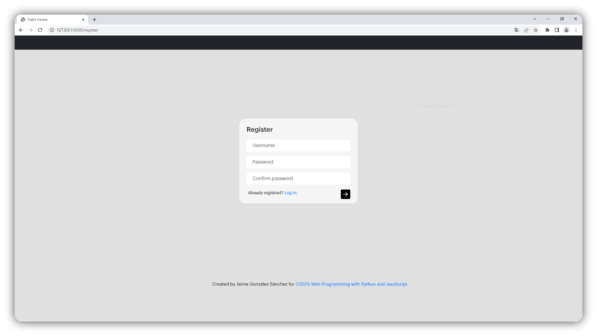
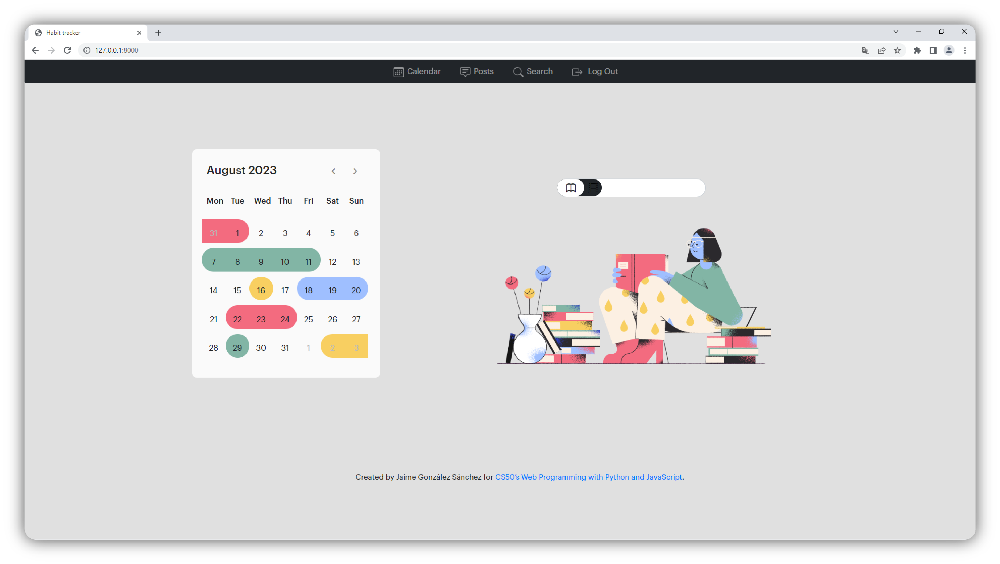
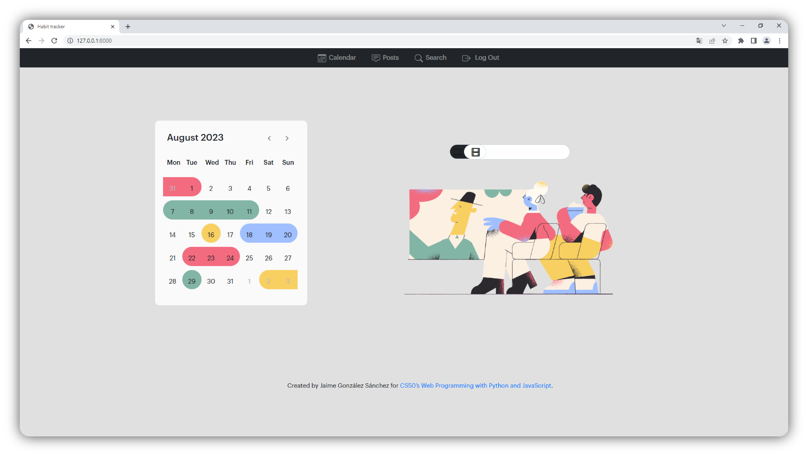
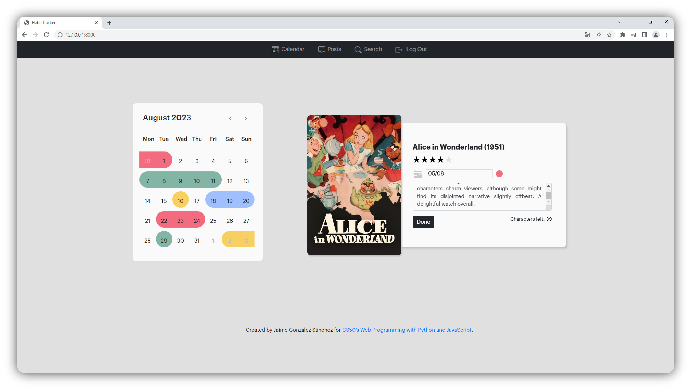
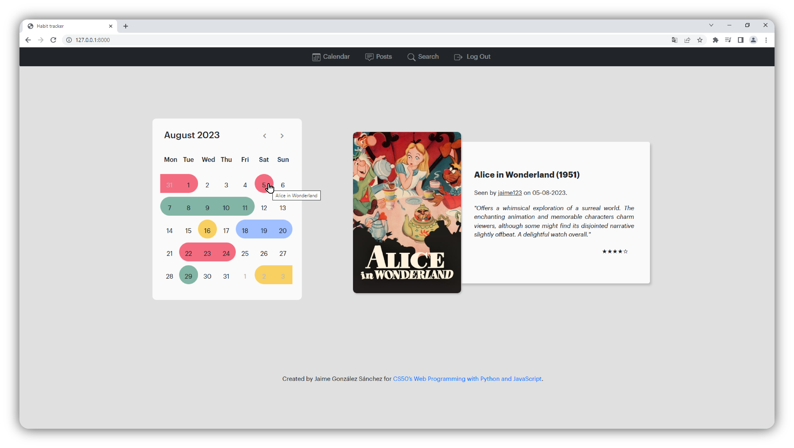
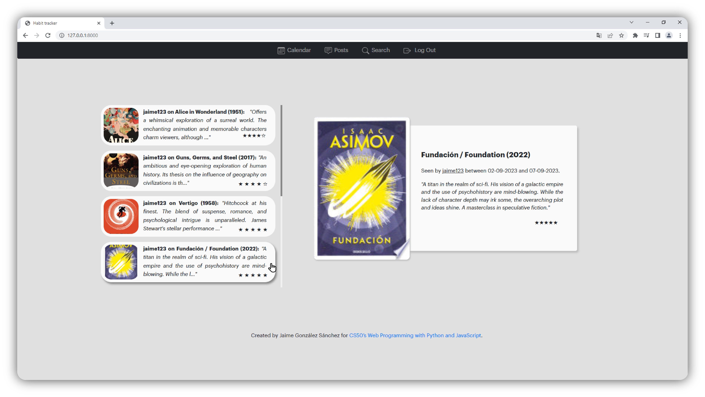

# Habit tracker

Habit Tracker is the final project for the CS50W course. The web application allows you to keep track of books you have read and movies you have watched, rate them and share them with other users. To develop the application, I used Django for the backend and Javascript for the frontend. It also uses the Google Books and The Movie Data Base APIs for querying. FlatPickr is used for dates selection.

## Distinctiveness and Complexity

Although this application builds on the knowledge acquired in the course projects, it differs from them in its content in that it responds to a practical need of its developer.

In general, applications that allow users to write reviews focus on one type of content (books, movies, etc.). In addition, they usually do not have an intuitive interface that allows the user to consult the entries made. On the other hand, applications for activity tracking do not usually provide links to other platforms for tracking this type of content (books, movies, etc.). They also tend to be too detailed (even down to the minute), which is unnecessary in this case. This web application attempts to combine a review system with an activity tracking system, thus overcoming the shortcomings that these applications tend to have separately.

Trying to take exploit the potential of Javascript, the goal was to create a dynamic single page web application that would provide a variety of functionality within a single environment without the need to reload pages or change views. Therefore, most of the activities of the web application are developed in a single template (`index.html`) managed by the Javascript file `habits.js`. As an exception, the authentication operations (login and logout) are handled differently, using their own specific HTML templates. (see [Files and directories](#files-and-directories))

The application uses the Google Books and The Movie Data Base APIs and fetch from Javascript to allow querying of books and movies. Once selected, a form is generated for the user to make the review, which remains in the Django models. The records made can be tracked through the automatic marking in the calendar (own user) or through the posting system (all users). From both functions, clicking on a specific item expands the review. (see [Main features](#main-features))


## Files and directories (created or modified)

  - `habits` - main application directory.
    - `static/habits` contains all static content.
        - `styles.css` - defines the styles of the various elements that make up the web application and adapts them for mobile devices using media queries.
        - `habits.js` - Javascript file that manages the functionality of the web application, modifying the basic html structure of `index.html`.
        - `images` - contains default images used on the search block (`books.png` and `movies.png`)
        - `readme` - cointains the images used on `README.md`
    - `templates/habits` contains all application templates.
        - `layout.html` - base template extended by `index.html`.
        - `index.html` - main template that contains the basic html structure (blocks) for the different features of the web application. These are managed with Javascript from `habits.js`.
        - `login.html` - template with the login form.
        - `register.html` - template with the register form.
    - `admin.py` - the models used are registered here.
    - `models.py` contains the models used in the project. `User` extends the default User model, `Genre`  includes the different genders of the registered book/movie, `Habit` stores basic info from a book/movie, and `Register` stores personalized reviews from users.
    - `urls.py` - contains all application URLs.
    - `views.py` - respectively, contains all application views.
    - `README.md` - provides information about the project.
    - `requirements.txt` - contains requirements for the application to run.


## How to use

First, references in [requirements.txt](/requirements.txt) must be installed.

You must also obtain the necessary API KEYs.

- TMDB: [https://developer.themoviedb.org/reference/intro/getting-started](https://developer.themoviedb.org/reference/intro/getting-started)

Once you have the API KEYS, you need to set them in the file [views.py](/views.py) (replace 123456789 with your API_KEY).

```
# Asign API KEYs
TMDB_KEY = '123456789'

```

### Register / Login

In order to use the application, users must create an account. This account allows the user to create and save their reviews. For this purpose, the Django authentication system is used. On registration/login forms, flash messages are displayed if the user enters incorrect values or leaves fields blank.




### Search
The user enters the title of the book or movie to register in the search bar.
User can toggle between books and movies by clicking the button on the search bar.
Depending on the selection, the web site will use either the Google Books API or The Movie Data Base.
There is no need for the user to manually submit the search, as the input is read and sent to the API every time a change is made. To avoid unnecessary requests, the connection to the API is made after a short time without the user typing anything.





### Show results
The covers/posters of the books or movies that match the search performed are displayed. Depending on the number of results, the container that includes them varies in size. The left and right buttons allow the user to scroll through the results, and the images enlarge as the mouse hovers over them.


### Register habit
Once one of the results is selected, a registration form is generated. This form includes the image of the book/movie, its title and year of publication, as well as a series of adjustable parameters that the user can personalize.
- **Rating:** Use a star rating to rate the book/movie.
- **Date:** Allows to set individual days or date ranges.
- **Color:** The user can specify the color that will be used to mark the habit on the calendar for easier identification.
- **Review:** The users have 250 characters to express their opinion about the book/movie. The remaining characters are displayed dynamically as the user types.



### Activity
Registered books/movies can be viewed in the calendar or in the posts. Each option is displayed as chosen from the navigation bar. Similarly, use the appropriate button in the navigation bar to stop viewing reviews and perform a new search.
- **Calendar:** The dates defined in the records are marked in the calendar with the color set by the user. Here the user can navigate through the different months and get an overview of the activity. Hovering the mouse over a marked date will display the title of the corresponding book/movie. Clicking on it will display the full dataset. FlatPickr is used for dates selection.
- **Posts:** The posts preview user reviews (your own and others). Clicking on any of them will display the full review.





## Mobile-responsive

The original design was adapted to a mobile device format. This was achieved by using Javascript to generate HTML elements based on the screen dimensions, and CSS with media queries.


### Video Demo:  <https://youtu.be/HAGk27PWv7w>


# Credits

Illustrations on seach block by Oleg Shcherba on Icons8. [https://icons8.com/illustrations/author/TQQ1qAnr9rn5](https://icons8.com/illustrations/author/TQQ1qAnr9rn5)


